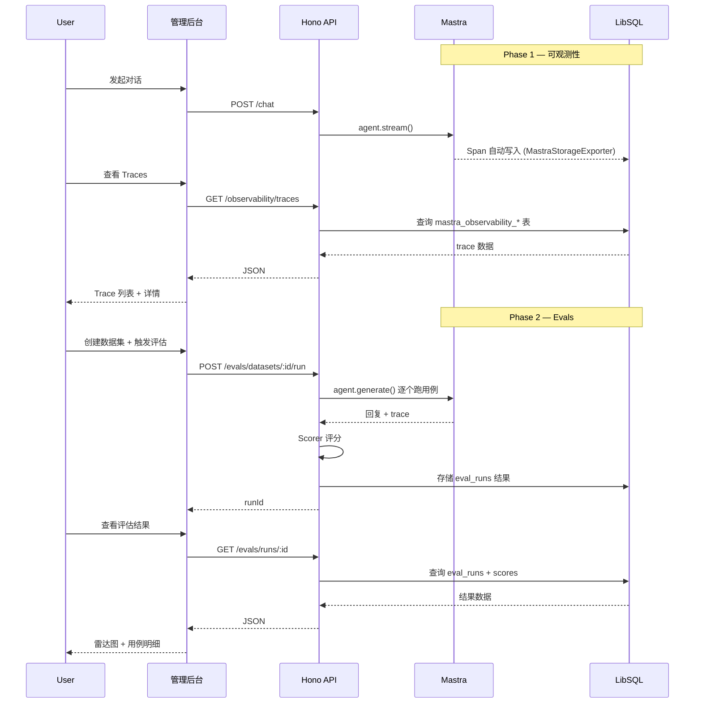

# P0 功能设计：可观测性与 Evals 评估

> 日期：2026-06-14
> 状态：已批准
> 关联：docs/insights/mastra-unused-features.md

## 概述

接入 Mastra 框架一等公民能力 `@mastra/observability`（已安装 ^1.14.1）和 `@mastra/evals`（已安装 ^1.3.0），实现 agent 调用链追踪和回答质量回归测试。

**目标**：全部覆盖，分阶段落地，可观测数据存入本地 LibSQL，通过管理后台查看。

---

## 阶段划分

| 阶段 | 内容 | 依赖 |
|------|------|------|
| Phase 1 | 可观测性基础设施（配置 + API + UI） | 无 |
| Phase 2 | Evals 评估体系（runner + dataset + scorer + API + UI） | Phase 1 |
| Phase 3 | 自动化与告警（CI 集成 + 阈值告警） | Phase 1, 2 |

---

## Phase 1 — 可观测性基础设施

### 1.1 新增模块 `agent/observability/`

```
packages/server/src/agent/observability/
├── config.ts          # Observability 配置单例
└── utils.ts           # Span 辅助函数
```

**config.ts** — 创建并导出 `getObservabilityConfig()`，返回 Mastra 构造函数所需的 `observability` 配置对象：

- `MastraStorageExporter` → 复用现有 `LibSQLStore`（已初始化），trace 数据写入 mastra_observability_* 表
- `ConsoleExporter` → 开发环境结构化日志输出
- `requestContextKeys: ['tenantId', 'userId', 'agentId']` → 自动提取到 span attributes
- 默认 `sampling: always`，Phase 3 改为 ratio 采样
- 排除 `SpanType.MODEL_CHUNK` 减少高频噪音

### 1.2 mastra.ts 变更

在 `new Mastra({...})` 构造函数中新增 `observability` 字段，引用上述配置。

### 1.3 API 路由 `api/observability.ts`

| 方法 | 路径 | 用途 |
|------|------|------|
| GET | `/api/v1/observability/traces` | 分页查询 trace 列表（筛选：dateRange, agentId, status） |
| GET | `/api/v1/observability/traces/:id` | 单条 trace 详情（span 树 + 耗时分解 + token 用量） |
| GET | `/api/v1/observability/stats` | 聚合统计（按 agent 的 token 用量、延迟 P50/P95/P99） |

遵循现有 Hono 路由规范：
- 首行 `getAuthContext(c)` 获取 tenantId/userId
- 不做 try-catch，异常自然冒泡
- 返回 JSON

### 1.4 前端页面 `pages-new/observability/`

- **TraceList 页**：时间范围筛选 + agent 下拉 + 结果表格（时间、agent、耗时、状态、token）
- **TraceDetail 页**：span 树形组件（递归渲染子 span）+ 每节点耗时 + token 明细 + metadata

状态覆盖：Skeleton 加载态、Empty（无 trace 数据）、Error（查询失败）、Normal

---

## Phase 2 — Evals 评估体系

### 2.1 新增模块 `agent/evals/`

```
packages/server/src/agent/evals/
├── runner.ts          # Eval 执行引擎（调用 agent.generate + scorer 评分）
├── datasets.ts        # 数据集管理（DB 持久化 + CRUD）
├── scorers.ts         # Scorer 注册表（封装 @mastra/evals 各 scorer）
└── types.ts           # 类型定义（Dataset, TestCase, EvalRun, EvalResult）
```

### 2.2 Scorer 注册表

封装 `@mastra/evals/scorers/llm/*` 中的预构建 scorer，分为 3 类：

| 类别 | Scorer | 评估目标 |
|------|--------|---------|
| RAG 质量 | `answer-relevancy` | 回复与问题的语义相关性 |
| RAG 质量 | `faithfulness` | 回复是否忠于知识库检索结果 |
| 工具调用 | `tool-call-accuracy` | 是否正确选择和调用工具 |
| 对话质量 | `hallucination` | 模型是否产生虚构/无根据内容 |

每个 scorer 返回标准化 0-1 评分。`runner.ts` 中为每个测试用例并行调用所有 scorer。

### 2.3 数据集管理

```
Dataset { id, name, agentId, tenantId, createdAt }
  └── TestCase[] { id, input: string, expectedTools?: string[], referenceAnswer?: string }
```

- 数据集 CRUD 通过 API 暴露
- 支持从已完成的对话（mastra_thread 表）一键导入为测试用例
- 存储复用现有 Drizzle DB（新增 `eval_datasets` 和 `eval_test_cases` 表）

### 2.4 API 路由 `api/evals.ts`

| 方法 | 路径 | 用途 |
|------|------|------|
| GET | `/api/v1/evals/datasets` | 数据集列表 |
| POST | `/api/v1/evals/datasets` | 创建数据集 |
| POST | `/api/v1/evals/datasets/:id/cases` | 向数据集添加测试用例 |
| POST | `/api/v1/evals/datasets/:id/run` | 触发评估（异步，返回 runId） |
| GET | `/api/v1/evals/runs/:id` | 查看评估结果（总分 + 各 scorer 分数 + 用例明细） |

### 2.5 前端页面 `pages-new/evals/`

- **DatasetList 页**：数据集 CRUD + 导入历史对话
- **DatasetDetail 页**：用例列表 + 用例编辑
- **EvalRun 页**：单次 run 的 scorer 雷达图 + 用例明细表（每题各维度得分）

状态覆盖同上。

---

## Phase 3 — 自动化与告警

### 3.1 CI 集成

- 在 `pnpm test` 中新增 eval smoke test：对核心 agent 跑最小数据集，总分低于阈值则失败
- 提供 `pnpm eval:run --dataset=<id>` CLI 入口

### 3.2 可观测性告警

- 新增 `observabilityAlertRules` 配置（token 用量突增阈值、延迟 P95 阈值）
- 在 `/api/v1/observability/stats` 中返回告警状态

### 3.3 采样策略调整

- 生产环境将 `sampling.type` 从 `always` 改为 `ratio`（如 0.1），降低存储压力

---

## 数据流



---

## 技术决策

| 决策 | 选择 | 原因 |
|------|------|------|
| Trace 存储 | LibSQL（复用现有） | 零新增依赖，管理后台可直接查询 |
| Scorer 模型 | 与被测 agent 相同的 LLM | Mastra 默认行为，保证评分一致性 |
| 评估执行 | 异步（后台任务） | 避免 HTTP 超时，大数据集可能跑几分钟 |
| 数据库新增表 | eval_datasets, eval_test_cases, eval_runs | 遵循现有 Drizzle schema 规范 |
| 前端图表 | Recharts（已安装） | 雷达图 + 柱状图 |

---

## 风险与缓解

| 风险 | 缓解 |
|------|------|
| mastra_observability_* 表结构不稳定（Mastra 还在迭代） | Phase 1 只读不写，通过 Mastra API 查询 |
| @mastra/evals scorer prompt 与中文不兼容 | 评估针对英文 prompt 的 agent，如需中文评估可后续自定义 scorer |
| 评估运行时大量 LLM 调用导致费用 | 限制数据集大小（≤ 20 条），Phase 2 选小样本快速验证 |
